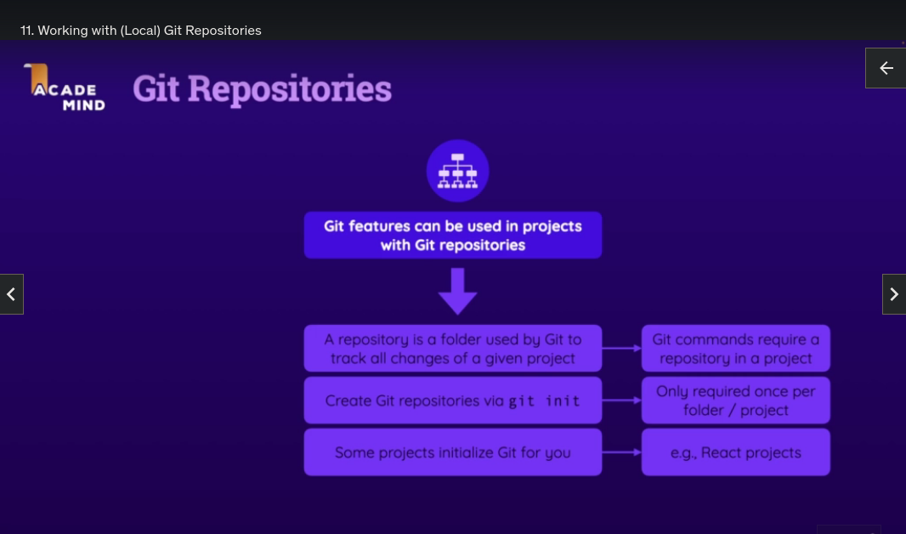
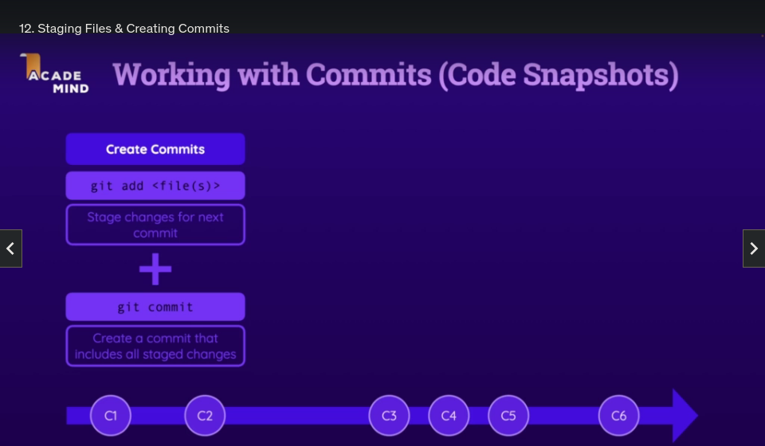
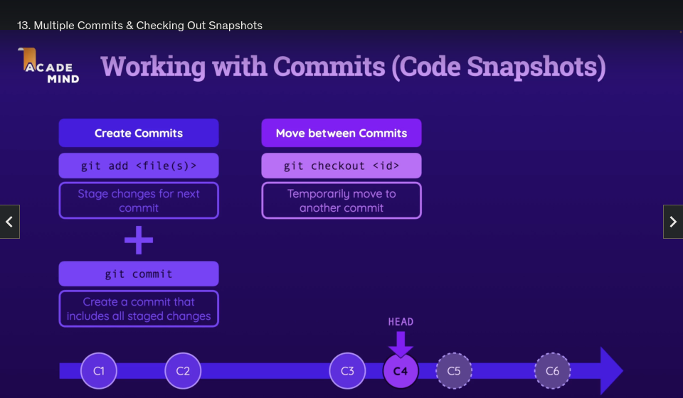
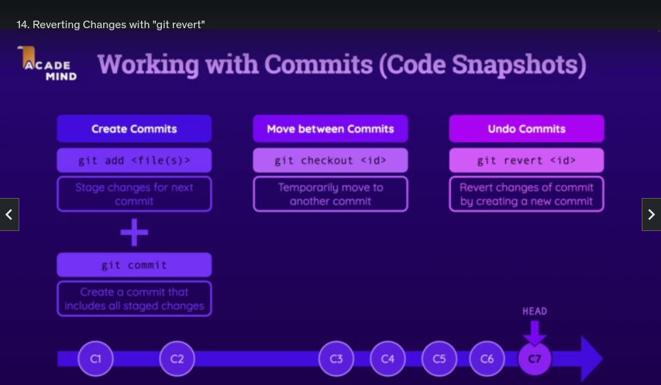
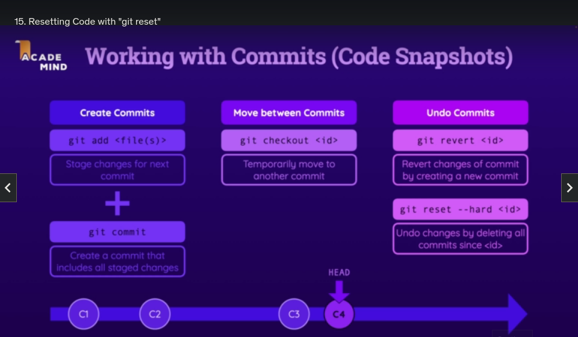
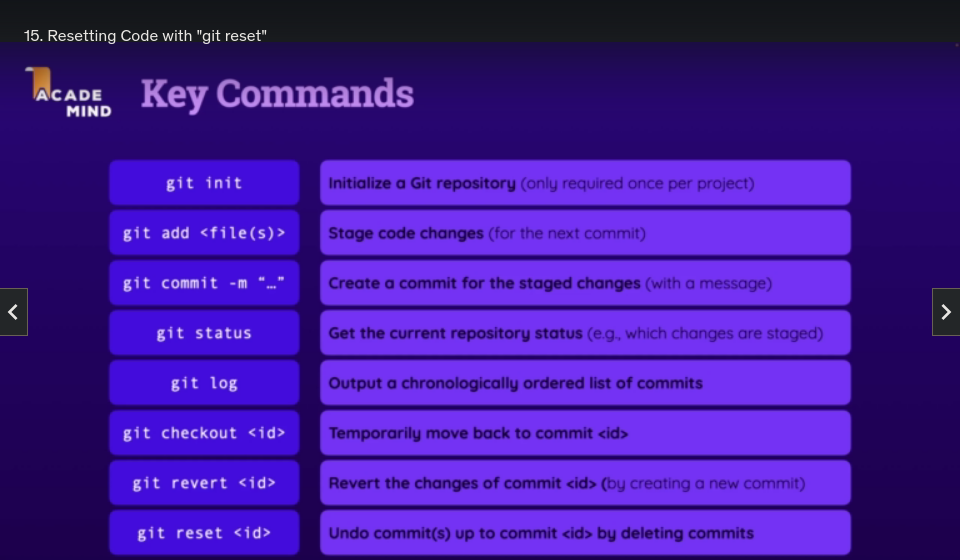
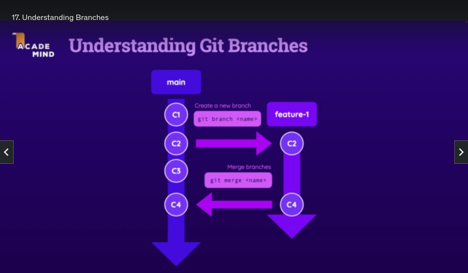
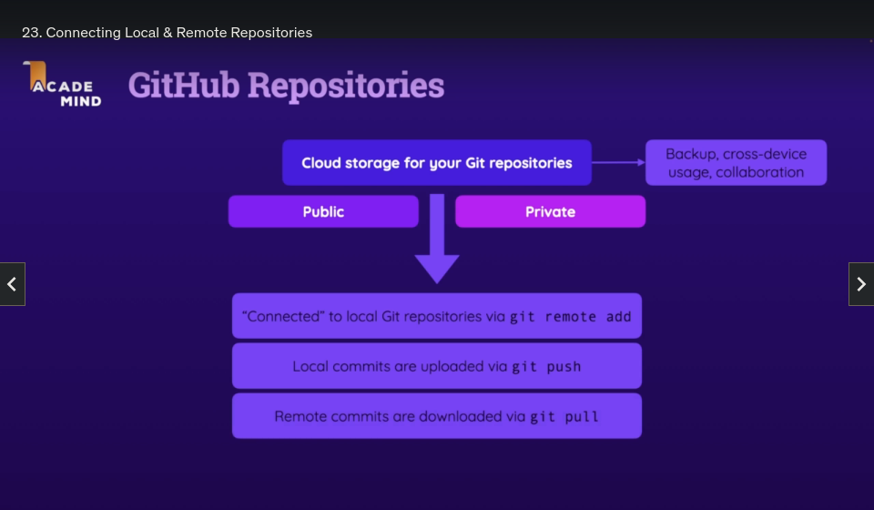

### Initialise the folder as a Git Repository

- `git init`

## Commits (Snapshots)

### Stage Changes for the Next Commit

- `git add <filename>`
- `git add /foldername`
- `git add *` or `git add .`

### Create a Commit that includes all Staged Changes

- `git commit -m "message"`

### Temporarily Move to Another Commit

- `git checkout <commit id>`

### Revert Changes of Commit by Creating a New Commit

- `git revert <commit id>`
  (!) But this adds a new Commit to undo all the changes of the previous commit

### Undo changes by deleting all commits since `<commit id>`

- `git reset --hard <commit id>`
  (!) You cannot get back those changes that were made after this point, and you are rewriting history, the idea of git is to keep history.

### Exclude files or folders from Git

- Create a `.gitignore` file in the root of the Repository
- Inside that file add the files or folders to be ignored

## Git Branches

Branches are containers that contain Commits

`main` is the default branch

You can have more than one branch in a project

You can create a new branch and it takes the current HEAD of the current branch you are in eg. `main` and makes that it's starting point

(All the older commits are also taken along)

So the same commit is now part of multiple branches

You can continue work in the `main` branch and create new commits but those new commits will not be part of the `new branch`

And you can work in the `new branch` and create new commits but those new commits will not be part of the `main` branch

In this way different teams can work on different branches without interfering with each other

Eventually though you will want to combine all of these changes, and you can merge those branches.

### Merge a Branch Into Another Branch

- `git merge <branch name that will get merged in to the currently checked out branch>`

All the commits that are part of `new branch` will be merged with the `main` branch.

Git will automatically try to merge those branches such that nothing is overwritten.

But if you do have clashing changes (merge conflicts) you might need to resolve those problems manually.

### List All Branches (and see which Branch is currently active)

- `git branch`

### Create a New Branch

- `git branch <new branch name>`

### Change to a Branch

- `git checkout <branch name>`

### Demonstrate the Commit exists in Multiple Branches

From the newly created branch

- `git log`

We can see the commit exists in both `feature` and `main`

- `commit ~0c2ec0cf (HEAD -> feature, main)`

### Deleting a Branch

- `git branch -D <branch name to delete>`

### Shorthand for Creating and Checking Out a New Branch

- `git checkout -b <new branch name>`

### Add a Remote to your Git Repository

This establishes a link between your local Git Repository and one on the Remote Git Repository on the Cloud

- `git remote add <some local name for the remote repository> <url of remote repository>`
- `git remote add origin https://github.com/username/some-repo.git`

### Push your Local Commits to the Cloud Git Repository

- `git push`

But:

`The current branch has no upstream branch` means Git doesn't know which Branch in the Remote Repository belongs to this Local Branch

### Establish a link between the Local and Remote Branches

We can establish a link between the Local and Remote Branches.
Note: if the Branch doesn't exist on the Remote Repository it will create that Branch.

One time push:

- `git push <local name for the remote branch> <branch name on the remote>`
- `git push origin main`

To set the link permanently:

- `git push --set-upstream origin main`

### Update the Remote URL

We can update the Remote URL:

- `git remote set-url <local name for the remote branch> <url of remote repository>`
- `git remote set-url origin https://bazmurphy@github.com/bazmurphy/some-repo.git`

### Download Commits you don't have yet from the Cloud Git Repository

- `git pull`

### Download a Remote Repository onto your Local Machine

- `git clone <url> <location to download to>`
- `git clone https://github.com/bazmurphy/some-repo.git .`

### Add Branch Protection on Remote Repository on the Cloud Git Repository (GitHub)

- Do not allow direct pushes to `main`
- Require a minimum of 1 review before a merge is allowed
- In this way Pull Requests must be made, reviewed, approved, and then can be merged to `main`

### Forking a Remote Repository

- You are essentially cloning that Repository on GitHub to your own Account.
- And since it is on your GitHub Account, you can clone that Repository Locally, Make Changes, Push those Changes to the clone (the Fork)
- From that you can then Create a Pull Request from your clone (Fork) to the original Remote Repository.
- So you can make Pull Requests across Respositories on GitHub.
- You can choose Compare Across Forks, and select the Repository and Branch to merge from and the Repository and Branch to merge into.
