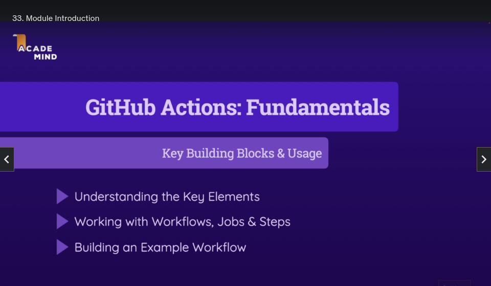
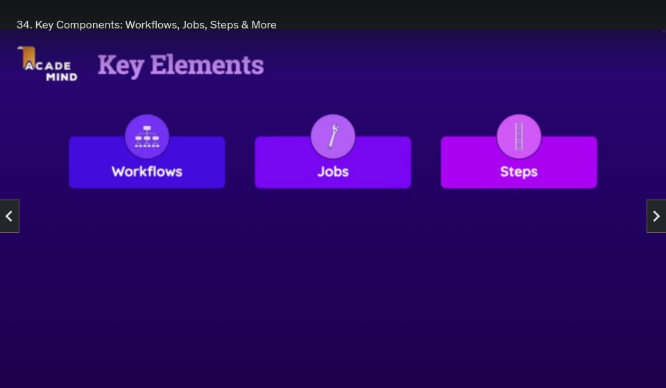
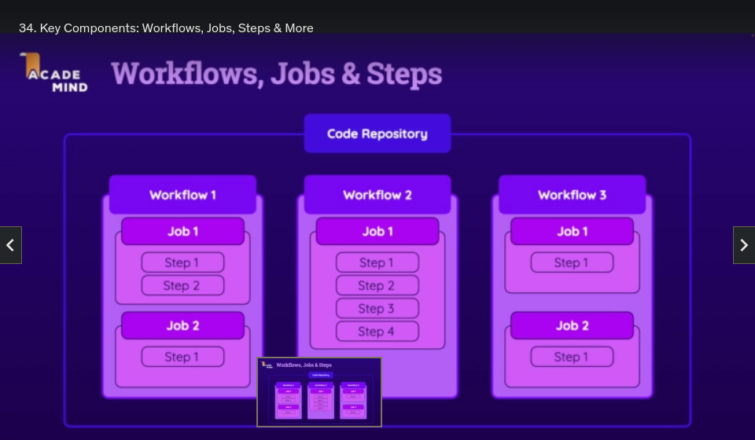
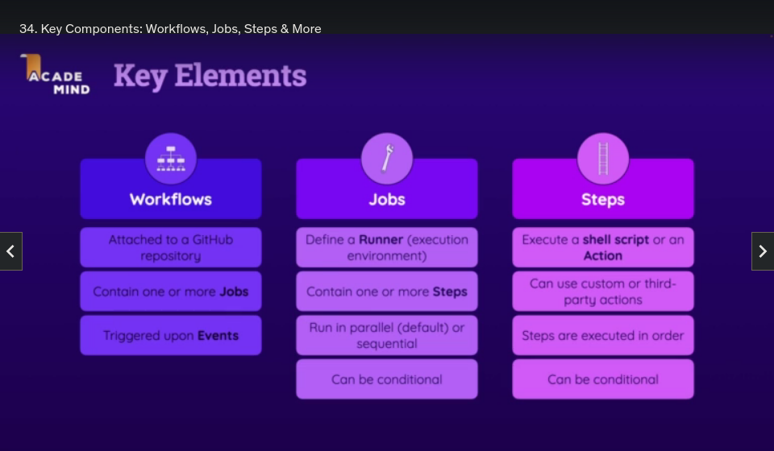
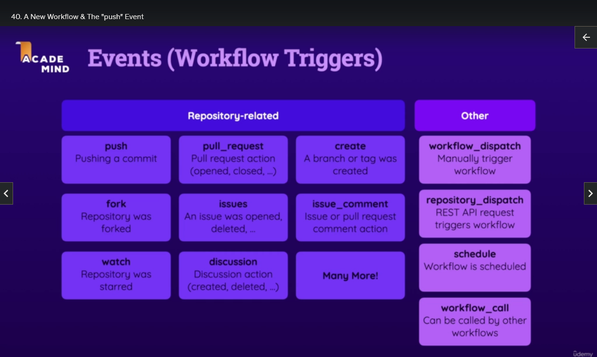
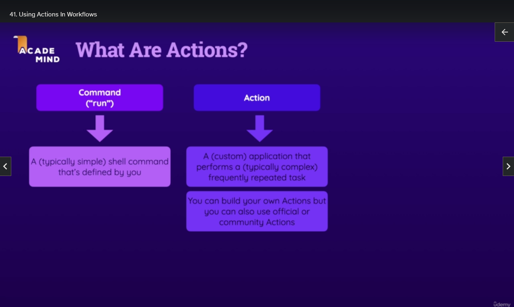

# GitHub Actions

## Key Building Blocks & Usage

## Key Elements

- Workflows

- Jobs

- Steps

## Relation

- You have a GitHub Repository

- Workflows are attached to those Repositories
- You can add as many Workflows as you want
- The Workflow is the first thing you build

- A Workflow includes one or more Jobs

- Jobs contain one or more Steps
- The Steps will be executed in the order they are specified
- And the Steps define the actual things that will be done

- 1st Step: Download the Code
- 2nd Step: Install the Depedencies
- 3rd Step: Run Automated Tests

- That's what you can do with a Github Actions Workflow, with a Job and the appropriate Steps.

- You can have as many Workflows as you want
- You can have as many Jobs in a Workflow as you want
- You can have as many Steps in a Job as you want

### Workflows

- Workflows are Attached to a GitHub Repository
- Contain one or more Jobs
- You should build those Workflows with those Jobs to set up some Automated Process that should Executed.
- You assign triggers called Events to your Workflows
- These Events define when a given Workflow will be Executed
- For example, whenever a new commit is pushed to a certain Branch

### Jobs

- The Jobs are the things inside the Events that contain the Steps that will be Executed.
- Every Job defines Runner which is the execution environment, the machine and operating system that will be used for Executing those Steps

- These Runners can be ones predefined by GitHub - they offer Linux, MacOS, Windows
- You can also configure your own Runners
- Jobs contain one or more Steps
- Jobs run in Parallel by Default or can run in Sequential order
- Jobs can also be Conditional

### Steps

- A Step is either:
- A shell script, a command in the command line that should be Executed
- Or an Action, which are a predefined script that perform certain tasks.
- You can build your own Actions if you need to
- A Job must have one or more Steps, and they are Executed in Order (not in Parallel)
- A Step can also be Conditional

# Events (Workflow Triggers)

https://docs.github.com/en/actions/using-workflows/events-that-trigger-workflows

Here are the Events:

- `branch_protection_rule`
- `check_run`
- `check_suite`
- `create`
- `delete`
- `deployment`
- `deployment_status`
- `discussion`
- `discussion_comment`
- `fork`
- `gollum`
- `issue_comment`
- `issues`
- `label`
- `merge_group`
- `milestone`
- `page_build`
- `project`
- `project_card`
- `project_column`
- `public`
- `pull_request` <-- on a Pull Request
- `pull_request_comment` (use issue_comment)
- `pull_request_review`
- `pull_request_review_comment`
- `pull_request_target`
- `push` <-- on a Push
- `registry_package`
- `release`
- `repository_dispatch`
- `schedule`
- `status`
- `watch`
- `workflow_call`
- `workflow_dispatch`
- `workflow_run`

And they have variations of them,
For example for a `pull_request`:

- `assigned`
- `unassigned`
- `labeled`
- `unlabeled`
- `opened` <-- when a Pull Request is opened
- `edited`
- `closed` <-- when a Pull Request is closed
- `reopened`
- `synchronize`
- `converted_to_draft`
- `ready_for_review`
- `locked`
- `unlocked`
- `review_requested`
- `review_request_removed`
- `auto_merge_enabled`
- `auto_merge_disabled`

## Where the Workflows are Executed

- GitHub Actions do not run inside the repository but are related to it.
- A GitHub repository is like a folder on a server, not a server (Runner) itself.
- When using GitHub Actions, you use a Runner, which is one of GitHub's servers
- So you usually need to download your code onto the Runner (GitHub's server) as a first step, especially if your workflow relies on your code.
- Installing dependencies and running tests are typically performed after downloading your code onto the Runner (GitHub server).

## Actions

- GitHub Actions consists of two key components: Workflows and Actions.
- Actions are custom or third-party applications that perform complex, frequently repeated tasks.
- Examples of Actions include fetching code from a GitHub Repository and downloading it onto a runner machine.
- Workflows, on the other hand, are a series of steps that define how Actions are executed.
- Workflows can use Actions as building blocks to automate various tasks.
- Actions can be distributed through a marketplace, and you can build your own Actions.
- In contrast, the "run" keyword in a YAML file allows you to define and execute commands on a runner machine, which can range from simple shell commands to more complex scripts.
- Both Actions and "run" commands are used to automate processes in the context of GitHub Actions.

- There is Marketplace for Actions: https://github.com/marketplace?type=actions
- We will use the official GitHub `checkout` Action: https://github.com/actions/checkout

- `uses` keyword - for Actions
- `with` keyword - for Action Options

- You can check what pre-installed software comes on the Runners
- https://docs.github.com/en/actions/using-github-hosted-runners/about-github-hosted-runners/about-github-hosted-runners
- The ubuntu-latest label currently uses the Ubuntu 22.04 runner image.
- https://github.com/actions/runner-images/blob/main/images/linux/Ubuntu2204-Readme.md
- Ubuntu 22.04

  - Installed Software
    - Node.js 18.18.2

- So we can see it already has Node 18 installed.
- But if we needed a different version we could make a Step using an Action:
- https://github.com/actions/setup-node/
