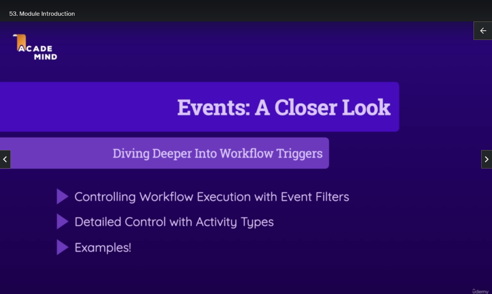
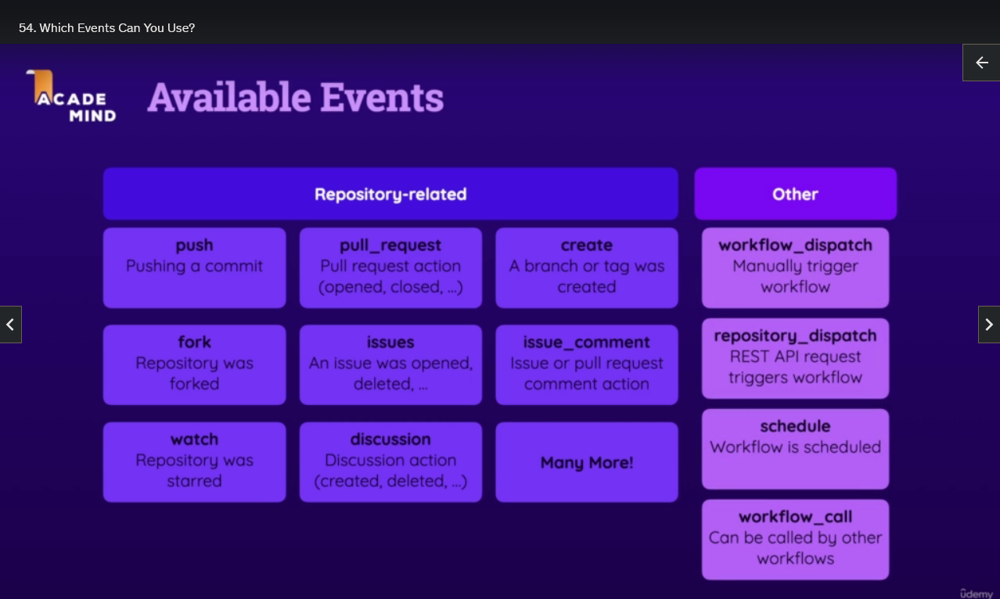
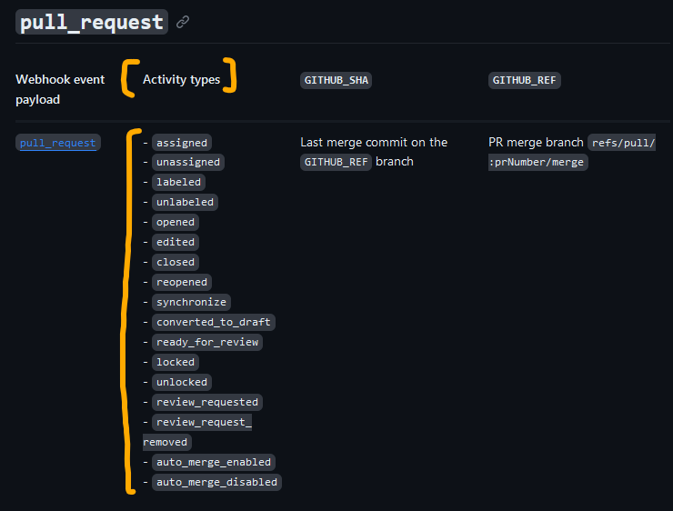
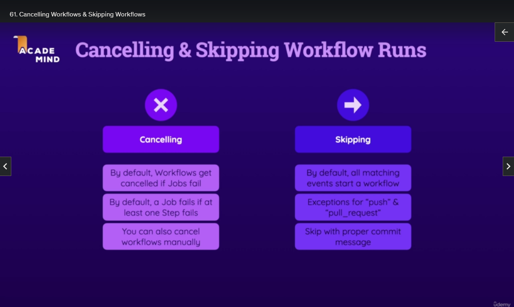
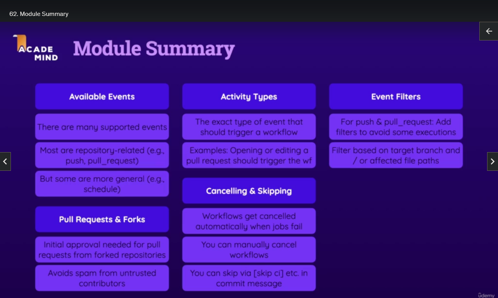

# Workflows & Events - Deep Dive

## Module Introduction



## Which Events Can You Use?



## A Demo Project Setup

-

## More on the "push" Event

- We can be more specific with Events
- For example instead of a `push` triggering all Workflows, a `push` to a specific branch can trigger a specific Workflow

## Introducing Event Filters & Activity Types

- Some Events have Activity Types

  - specify in greater detail which exact version or variation of the Event should trigger a Workflow
  - `pull_request` Event has for example `opened`, `closed`, `edited`, etc

- Some Events have Filters
  - more control over when a Workflow will be triggered
  - `push` Event can be filtered based on target branch (`main` for example)

## Using Activity Types

https://docs.github.com/en/actions/using-workflows/events-that-trigger-workflows

- On `pull_request` Event we can see the Activity Types



- If we don't select any Activity Types all (or predefined) types will Trigger the Workflow
- For `pull_request` Event the documentation states that `opened`, `synchronize`, `reopened` will Trigger the Workflow (if no Activity Types are defined)
- We can also define specific Activity Types eg. `closed`

```yml
on:
  # specific Event
  pull_request:
    # specific Activity Types
    types:
      # Activity Type Name
      - opened
  # another Event
  workflow_dispatch:
```

## Using Event Filters

- If we want to listen to the `push` Event it will listen for all pushes against all branches
- And we probably don't want that, especially for Workflows that have Deploy steps
- So only pushes to the `main` branch should trigger that specific Workflow

https://docs.github.com/en/actions/using-workflows/workflow-syntax-for-github-actions#onpushbranchestagsbranches-ignoretags-ignore

```yml
on:
  # Push Event
  push:
    # the Workflow will only trigger when a push happens on the following branches:
    branches:
      - main
      - "dev-*" # dev-new1 dev-new2
      - "feat/**" # feat/new1 feat/new/button
```

- `*` allows any character except `/`
- `**` allows any character including `/`

- You can also add these filters to the `pull_request` so that either pushes or pull requests to these branches trigger the Workflow

https://docs.github.com/en/actions/using-workflows/workflow-syntax-for-github-actions#onpull_requestpull_request_targetbranchesbranches-ignore

```yml
on:
  # Pull Request Event
  pull_request:
    # specific Activity Types
    types:
      # Activity Type Name
      - opened
    # the Workflow will only trigger on a pull_request to the following branches:
    branches:
      - main
      - "dev-*" # dev-new1 dev-new2
      - "feat/**" # feat/new1 feat/new/button
```

- You can also filter based on the `paths` and `paths-ignore` filters
- `paths` defines which folders/files trigger the Workflow
- `paths-ignore` defines which folders/files should be ignored and not trigger the Workflow

```yml
on:
  # Push Event
  push:
    # only files changed in the specified folder(s) will trigger the Workflow
    paths:
      - "03-project/**"
    # files in the specified folder(s) will not trigger the Workflow
    # if a file in the specified folder is changed this will prevent the Workflow from running (even if other files are changed)
    paths-ignore:
      - ".github/workflows/*"
```

- Cheat Sheet https://docs.github.com/en/actions/using-workflows/workflow-syntax-for-github-actions#filter-pattern-cheat-sheet

## Special Behaviour: Forks & Pull Request Events

- By default, Pull Requests based on Forks do NOT trigger a Workflow
- Because Everyone can fork and open Pull Requests

- Because people could make malicious Workflow Runs and excess cost could be caused
- So first time contributors must be approved manually before the Workflow runs
- Subsequent pull requests will then run the Workflow automatically

- If you add a Collaborator then this behaviour does not happen
- Because if you added someone as a Collaborator it means you trust them

## Cancelling Workflows & Skipping Workflows

- You can cancel a Workflow run by going to the GitHub Repository and then Actions and manually cancelling the Workflow

- If you want to skip a Workflow run you can add one of these to the end of your commit message

  - `[skip ci]`
  - `[ci skip]`
  - `[no ci]`
  - `[skip actions]`
  - `[actions skip]`



## Module Summary


