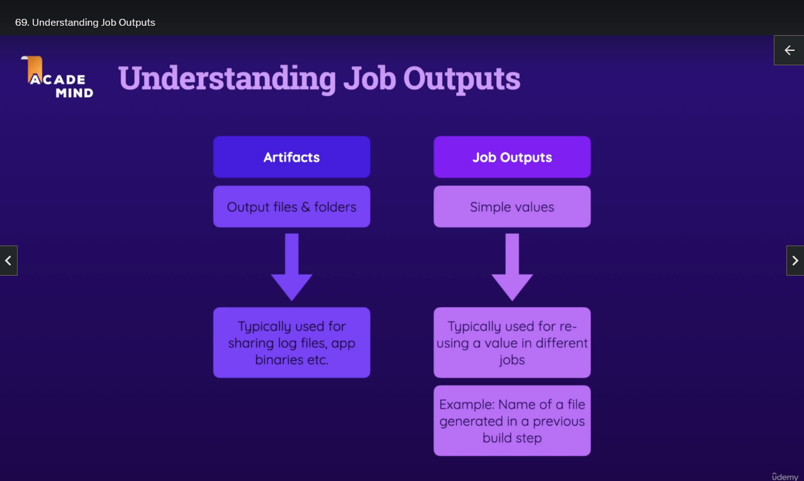
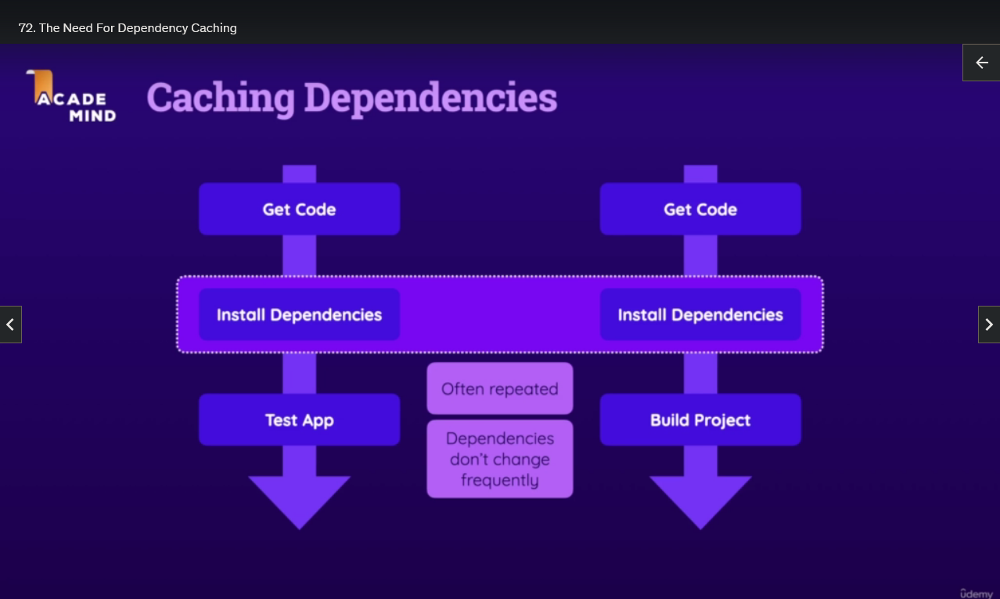
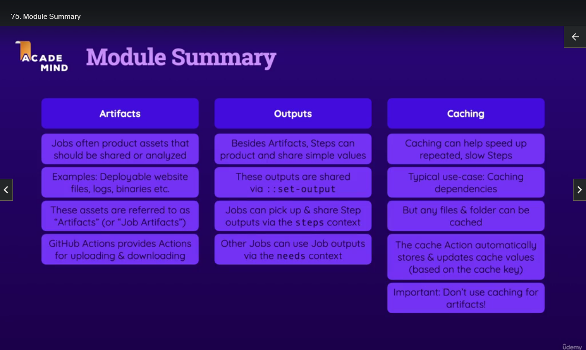

# Job Artifacts & Outputs

## Module Introduction


## Demo Project Setup

-

## Understanding Job Artifacts


- Job Artifacts

- When we run a Job, Examples:

  - Building a Website produces a build/dist folder
  - Building a Mobile App produces a Package to upload to an App Store
  - Building an Desktop App produces an Binary Executable

- We generate some assets that we upload somewhere
- These assets are generally called Job Artifacts
- A Job Artifact is the Output/Assets generated by a Job

- With GitHub Actions we can save those Artifacts

  - We can download them manually
  - We can download them automatically and use them in other Jobs

- It doesn't have to be just binaries, it can also be log files etc.
- But they are files/folders produced by a Job that we want to use in other Jobs or manually inspect

## Artifacts - An Example

- When we run `npm run build` for example it produces a `/dist` folder

- It would be useful if we could store and use those produced folders/files

- Well we can store them and access with GitHub Actions

- This `/dist` folder is the Artifact produced by the `build` Job

## Uploading Job Artifacts

- To store the Artifact we add a new Step

- We use an Action `actions/upload-artifact@v3`
  https://github.com/actions/upload-artifact

- `name` is required, we use it to retrieve the artifact later
- `path` is required, to tell it which files/folders to store

```yml
steps:
  # This allows us to Upload Artifacts
  - name: Upload Artifacts
    uses: actions/upload-artifact@v3
    with:
      # we give the Artifact a name, so we can retrieve it later
      name: dist-artifact
      # this defines which files you want to store
      path: dist
```

- Now when we run this Workflow, if we visit the Workflow that was run on GitHub, the artifacts are available at to manually download

## Downloading Artifacts (Manually & Automatically)

- Each Job is run on its own Runner, the Artifact produced in the `build` Job will not automatically exist in the `deploy` Job.
- So if we want to use the Artifact created in the `build` Job in the `deploy` Job, we need a way of getting a hold of the Artifact.
- In order to get those Artifacts we need to download them using an Action
- Download Artifact Action https://github.com/actions/download-artifact

- We must provide a `with` and a `name` that references the Artifact identifier (in this case from the `build` Job above)

- NOTE: It unzips the Artifact, but WITHOUT the original folder, so the files will not be inside a `dist` folder but in the root of the default directory

```yml
steps:
  - name: Download Artifacts
    uses: actions/download-artifact@v3
    with:
      # we need to provide the Artifact identifier
      name: dist-artifact
```

## Understanding Job Outputs



- Jobs can also produce/provide Outputs
  - a simple value (a number, or some text, etc) produced by the Job (that should be accessible by other Jobs)
  - typically used for reusing a value in different Jobs
  - example: the name of a file used in a previous `build` Step

## Job Outputs - An Example

- For a contrived example, We will try to get the name of the javascript file in the `/assets` folder because it's randomly generated
- We can get the name in the `build` Job and make it available in the `deploy` Job
- So we have one Value that is made by one Job and use it in another Job

- We need to use another keyword `outputs` and it must be BEFORE `steps`
- Provide a name/identifier for our output eg. `javascript-file`
- And the value uses GitHub Actions Context `steps.(id of the step).outputs.(key name)`

```yml
# We define the Outputs
outputs:
  # We give it an identifier and use the GitHub Actions Context
  # Using steps.(id of the step).outputs.(key name)
  javascript-file: ${{ steps.publish.outputs.javascript-file }}
```

- We then get the name of the javascript file from the assets folder using a linux shell command

```yml
steps:
  # We create a step to create an Output value
  - name: Publish JS filename
    # we can access data from this step via this id
    id: publish
    # a regular a linux shell command that:
    # finds the javascript file in the assets folder
    # you use an identifier key of your choice and store the value in it eg. javascript-file=filename.js
    # it then writes that key=value pair into a special file $GITHUB_OUTPUT created by GitHub in the Environment your Job is running
    run: find dist/assets/*.js -type f -execdir echo 'javascript-file={}' >> $GITHUB_OUTPUT ';'
```

- `find`: find is a command used to search for files and directories in a specified location.

- `dist/assets/*.js`: This is the search path for the find command. It's looking for files with a `.js` extension in the `dist/assets` directory.

- `-type f`: This is an option for the find command. It specifies that only regular files should be considered, excluding directories and other types of files.

- `-execdir`: This is another option for the find command. It is used to execute a command in the directory where the file is found. This is useful when you want to perform an action on each file individually.

- `echo 'javascript-file={}' >> $GITHUB_OUTPUT`: This is the command that is executed for each found file. It uses `echo` to print a message to the standard output, where `{}` is a placeholder that will be replaced by the name of the found file. The output is then appended to a file or variable named `$GITHUB_OUTPUT`

- `;` is used to terminate the `-execdir` option for the `find` command. It tells `find` that the command provided for `-execdir` is complete. In Linux, the semicolon `;` is often used to separate multiple commands on a single line.

- An older syntax (deprecated) for this was `find dist/assets/*.js -type f -execdir echo '::set-output name=javascript-file::{}' ';'`

## Using Job Outputs In Other Jobs

- We can use the GitHub Context, and specifically the `needs` object
- The `needs` object contains the Outputs of all Jobs that are defined as a Dependency of the current Job.
- So we use `needs.(other job name).outputs.(output-identifier)`
- Now we have successfully passed an Output from the `build` Job to the `deploy` Job

```yml
deploy:
  needs: build
  steps:
    - name: Output JS filename
      run: echo "${{ needs.build.outputs.javascript-file }}"
```

## The Need For Dependency Caching



- It is very common in CI/CD Workflows to run some build step that generates files/folders

- We are running some Steps that are repeated across different Jobs
- Getting the Code we HAVE to do on each job, because each Job runs on its own Runner, so we HAVE to get the Code every time, but this is relatively fast
- `Install Dependencies` is the step that currently takes the longest time.
- It would be better to only `Install Dependencies` once in one Job and then Cache them so that other Jobs can reuse them.
- So if you have two Workflows that do slightly different things but share some of the same Steps, it makes sense to only Install Dependencies once.

- You can also Cache files/folders across Workflow Executions
- Because if you have files/folders that don't change at all across different Workflows it makes sense to Cache them so they don't have to be re-downloaded or re-created all the time

- GitHub Actions has the Cache Action for doing exactly this https://github.com/actions/cache

## Caching Dependencies in Practice

- When we first `Install Dependencies` we want to Cache them.
- We do this in the first Job where that happens in the Workflow.
- So the Cached Dependencies can be used in subsequent Jobs and subsequent Workflow Runs unless the Dependencies change and must be re-installed.

- (!) To Add Caching we must add a new Step BEFORE the Step that actually produces the files/folders that should be Cached

- You use the `uses: actions/cache@v3`
- It requires `path` which points at the files/folders that should be Cached
- In this case on the ubuntu-latest Runner for the Node Dependencies it is `~/.npm`
- `~/.npm` is the path used by the NPM tool for it's internal Dependency Cache which we want to store across Jobs and across Workflows
- NPM already builds a Cache that contains the Dependencies that were installed, and that Cache would be used if you Install Dependencies again in the future, but since different Jobs use different Runners, and different Workflow Executions also use different Runners, that automatically created NPM Cache would not be stored and used.
- Using the `actions/cache@v3` we tell GitHub Actions that the `~/.npm` folder should be stored in some place on GitHub's Cloud and should be re-used in other Jobs and other Workflow Executions.

- It requires `key` which is used for retrieving the Cache in the future and recreating those files/folders on the Runner
- The `key` also determines if the Cache should be discarded because something changed
- We must use a dynamic `key` name
- We can do this using the `hashFiles()` GitHub Action function that you pass a filename and the hash will change if the file contents change.
- So the `key` name will stay the same if the file contents are the same, but the key name will change if the file contents change.
- When the `key` changes GitHub Actions knows to discard the Cache and recreate it
- `key: dependencies-node-modules-${{ hashFiles('package-lock.json') }}`
- We could use `**/package-lock.json` to get ALL package-lock.json files in the Project and it becomes a combination of all of those files.

- the next step `Install Dependencies` `npm ci` will automatically use the `./~npm` folder if it exists, and if it doesn't exist the Dependencies will be re-downloaded

- (!) When the Job is finished the Cache step will automatically look at the `path` folder and put that `path` folder into the Cache if it didn't have it before.
- (!) So the Cache does not just execute in the Step but also after the Job has finished to update the Cache
- So that if new Dependencies were installed then new Dependencies will be Cached again

- The way you use the Cache depends on the Project: https://github.com/actions/cache#implementation-examples

- (!) We now must repeat that Step in all the Jobs that `Install Dependencies`
- The Cache is centrally available, so if we put the Dependencies in the `test` Job the `build` Job will use that same Cache
- So there is no Job specific Cache, but one central Cache, which is also available across Workflow Executions
- So if Dependencies were Cached in one Job they will be available in other Jobs and other Workflow Execution Cycles

```yml
test:
  steps:
    # we start the Cache here before the `Install Dependencies` Step
    - name: Cache Dependencies
      uses: actions/cache@v3
      with:
        # `path` is the files/folders that should be Cached
        # if this folder exists it will be used, otherwise the Cache will be re-downloaded
        # also the Action executes AGAIN when the Job finishes
        # and will look at this folder and update the Cache if it didn't have it before or there are any changes
        path: ~/.npm
        # `key` is used for retrieving the Cache in the future and recreating those files/folder on the Runner
        # the key also determines if the Cache should be discarded because something changed
        # so we must give the key a dynamic name (using a GitHub Action function)
        # now whenever the package-lock.json changes the hash produced will change and so the key name will change
        # and when the key changes it will know to discard the Cache and recreate it
        key: dependencies-node-modules-${{ hashFiles('package-lock.json') }}
    - name: Install Dependencies
      # now the npm ci will automatically use the ./~npm folder
      # if it exists it wil be used, if it doesn't exist the Dependencies will be re-downloaded
      run: npm ci
```

## Using & Invalidating Caches

- If the Cache already exists then that Step will run faster
- If the Cache does not exist then it will be created and subsequent Steps that use that Cache will run faster
- If the file contents of `package-lock.json` change using `npm upgrade` then the dynamic `key` will change and it will invalidate that Cache and create a new one

## Module Summary


