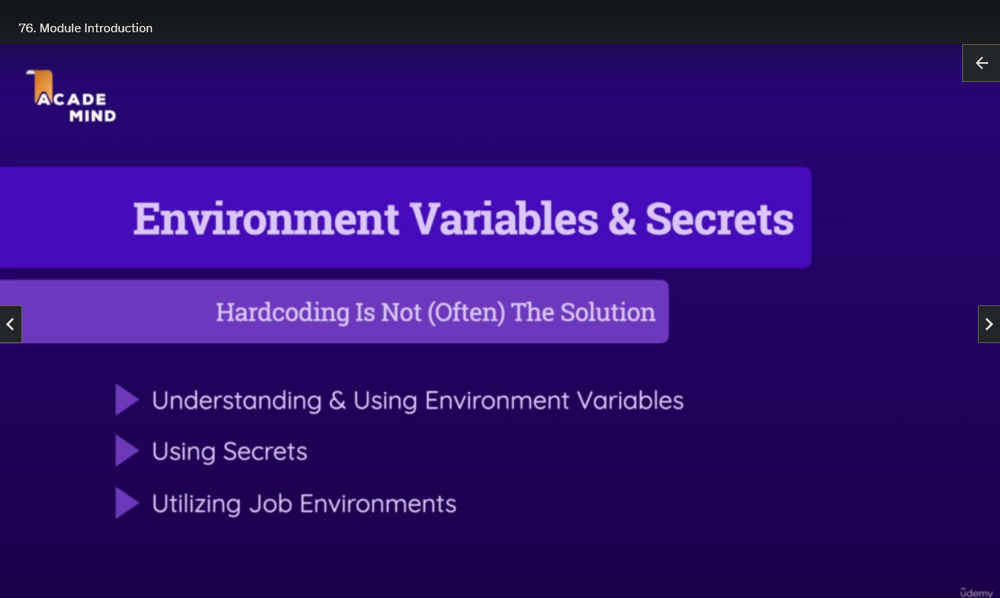
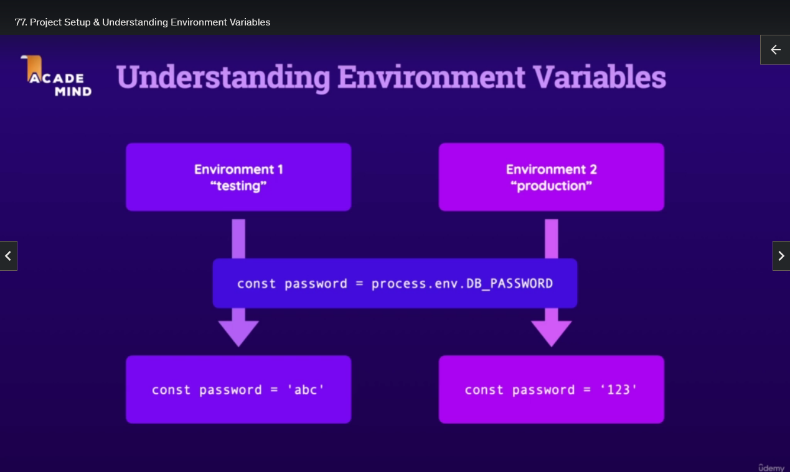
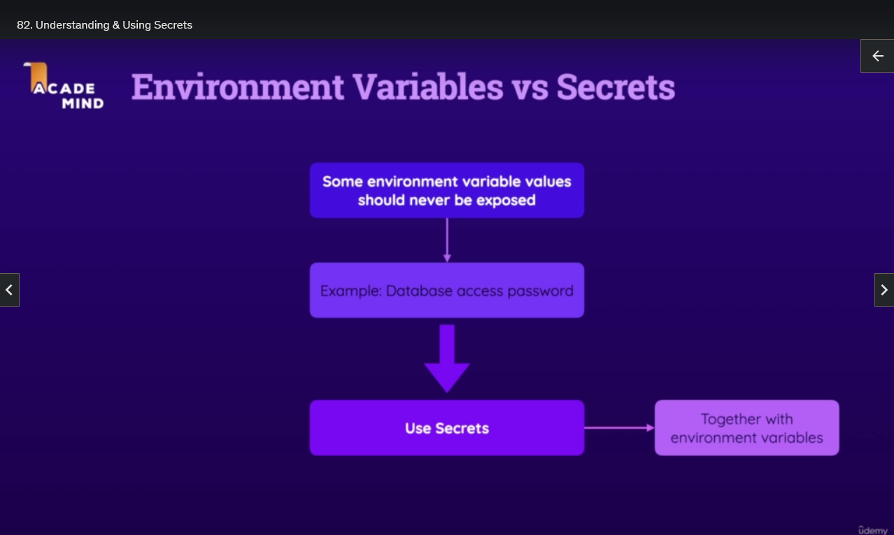

# Using Environment Variables & Secrets

## Module Introduction



## Project Setup & Understanding Environment Variables



- In your code you need to have certain dynamic Values
- For example in Node `process.env.VARIABLE_NAME`
- Like a password that is used for logging into a Database
- But there might be different databases for different Environments `testing` and `production`
- So different password values might be needed
- We have to provide those values to our Workflow, and they may need to change depending on the Job

```js
// DATABASE
const clusterAddress = process.env.MONGODB_CLUSTER_ADDRESS;
const dbUser = process.env.MONGODB_USERNAME;
const dbPassword = process.env.MONGODB_PASSWORD;
const dbName = process.env.MONGODB_DB_NAME;

// PORT
app.listen(process.env.PORT);
```

## Providing Environment Variable Values

- You can provide `environment` variables at different places
- You can provide the values at the Workflow level, Job level, and Step level

```yml
name: Deployment
on:
  push:
    branches:
      - main
      - dev
# Set the environment variables at the Workflow level
env:
  MONGO_DB_NAME: some-database-name
```

```yml
name: Deployment
jobs:
  test:
    # Set the environment variables at the Job level
    env:
      MONGODB_CLUSTER_ADDRESS: some-test-database-address
      MONGODB_USERNAME: some-test-database-username
      MONGODB_PASSWORD: some-test-database-password
      PORT: some-api-server-port
```

## Demo: Creating a Database & Using Database Environment Variable Values

- We create a MongoDB, and get the various values, and adjust the Environment Variables

```yml
name: Deployment
# Set the environment variables at the Workflow level
env:
  MONGODB_DB_NAME: some-database-name # some-database-name
jobs:
  test:
    # Set the environment variables at the Job level
    env:
      MONGODB_CLUSTER_ADDRESS: cluster0.3ekyupv.mongodb.net # some-test-database-address
      MONGODB_USERNAME: some-username # some-test-database-username
      MONGODB_PASSWORD: some-password # some-test-database-password
      PORT: 4000 # some-api-server-port
```

## Using Environment Variables in Code & Workflows

- Environment Variables defined in Workflows are available to all Jobs and Steps
- Environment Variables defined in one Job are only available to that Job and its Steps
- Environment Variables defined in one Step are only available to that Step

- You can access the Environment Variables with `$VARIABLE_NAME` in Linux
- You can also use the GitHub Actions syntax `${{ env.VARIABLE_NAME }}`

## Default Environment Variables

https://docs.github.com/en/actions/learn-github-actions/variables#default-environment-variables

- `CI` - Set to true when running in GitHub Actions.
- `GITHUB_ACTION` - The name of the current action.
- `GITHUB_ACTOR` - The user that triggered the workflow.
- `GITHUB_REF` - The branch or tag ref that triggered the workflow.
- `GITHUB_SHA` - The commit SHA that triggered the workflow.
- `GITHUB_WORKSPACE` - The workflow's working directory.
- `GITHUB_WORKFLOW` - The name of the workflow.
- `GITHUB_RUN_ID` - The unique id of the workflow run.

- `GITHUB_ENV`: Set environment variables for future steps in current job
- `GITHUB_PATH`: Modify PATH for future steps in current job
- `GITHUB_OUTPUT`: Set outputs for downstream jobs

These variables provide information about the workflow run context like who triggered it, what commit and branch triggered it, the workspace directory, etc.

They allow a workflow to adapt based on this context.

The runner related variables (`RUNNER_NAME`, `RUNNER_OS` etc) provide info about the environment the workflow is running on.

## Understanding & Using Secrets



- We often have credentials that we do not want to publicly exposed in a Workflow
- Secrets are similar to Environment Variables but stored so that no one can access them

- They are available in all Actions in all Workflows that are executed in the Repository

- You can store them on Repository level
- `Settings` > `Secrets and variables` > `Actions` > `New Repository Secret`

- We make `MONGODB_USERNAME` and `MONGODB_PASSWORD` Secrets in GitHub

- When you want use a Secret we use the GitHub Actions `secrets` context object `${{ secrets.VARIABLE_NAME }}`

## Utilizing Repository Environments

## Module Summary
