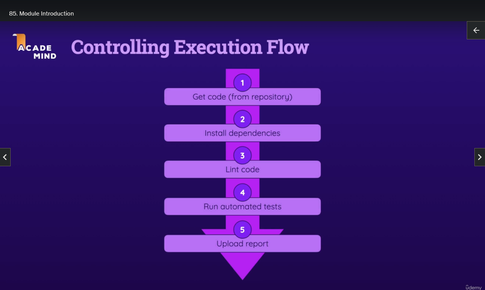
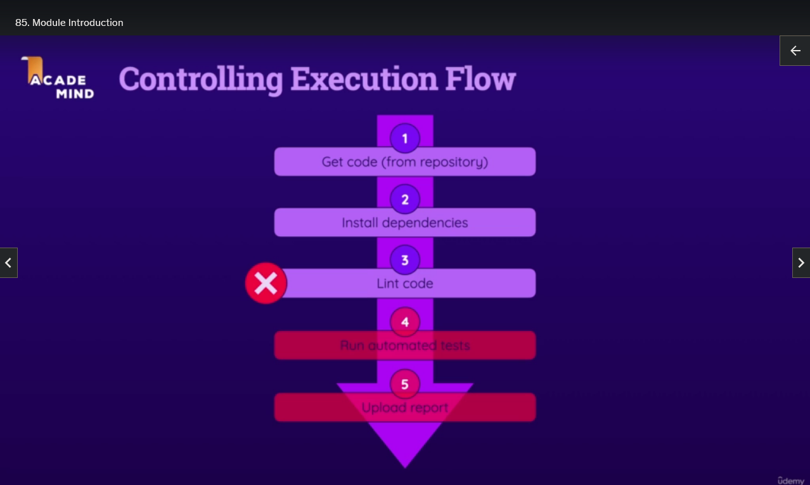
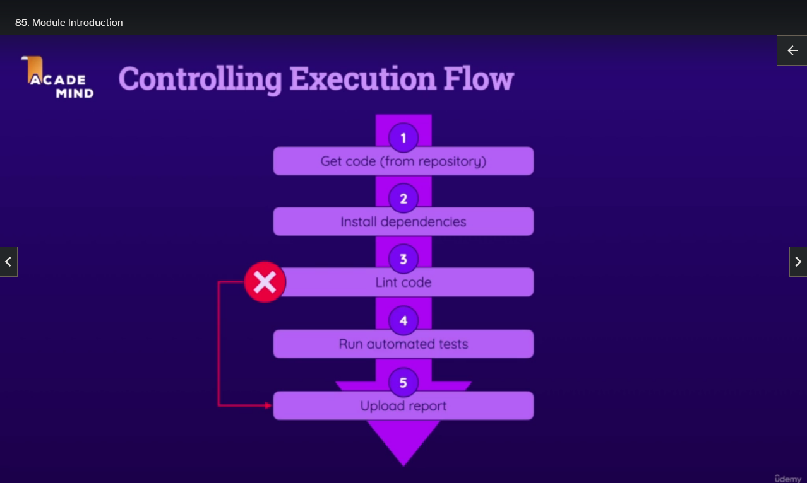
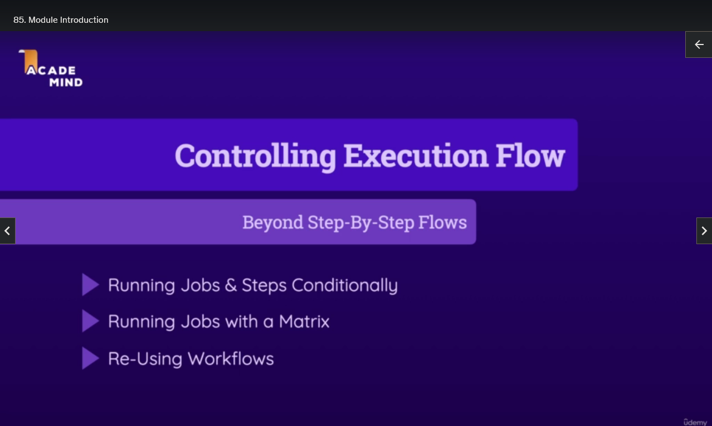
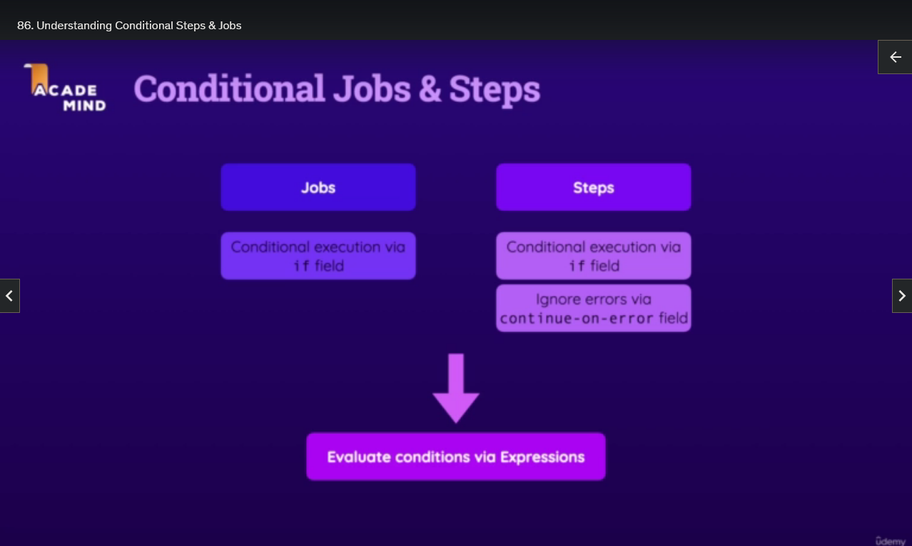

# Controlling Workflow & Job Execution

## Module Introduction

- Workflows typically run from start to finish and stop execution if an error occurs
- Job execution is canceled if any Step within the Job fails
- Default behaviour is for all subsequent Steps and Jobs not to be executed if one Job fails
- In some cases, you may want to continue executing Steps even if one Step fails
- You might also need Steps to be executed only if another Step fails
- It's important to have control over when specific Jobs and Steps execute
- Execution flow control allows you to run Jobs and Steps conditionally
- GitHub Actions provides tools to control Job and Step execution
- Concepts like execution matrices and Job matrices will be explored
- Reusable Workflows can reduce the need for extra code and save time

## Understanding Conditional Steps & Jobs

- Conditional Job and Step execution is introduced using two main tools:
  - the `if` field, which can be added to Jobs and Steps to specify conditions for execution
  - the `continue-on-error` field, which allows certain Steps to proceed even if others fail
- Expressions can be used to customize conditions for both the `if` and `continue-on-error` fields

## Demo Project Setup

## Understanding a Potential Problem: A Failing Step

## Controlling Execution via "if"

## Working with Special Conditional Functions

## Conditional Jobs

## More "if" Examples

## Ignoring Errors & Failures with "continue-on-error"

## Understanding & Using Matrix Strategies

## Including & Excluding Values (Matrix Strategy)

## Saving Time & Code with Reusable Workflows

## Adding Inputs to Reusable Workflows

## Reusable Workflows & Secrets

## Reusable Workflows Outputs

## Module Summary
